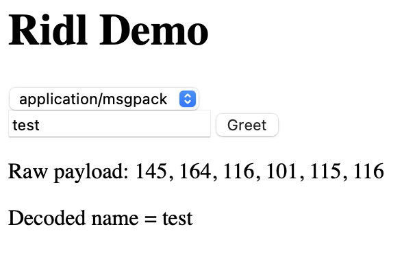

# Ridl

An [interface description language][wiki] using Rust.
Designed to replace Protobuf, Thrift, Cap'n'Proto, etc, by taking
advantage of Rust structs and the many language bindings available.

[wiki]: https://en.wikipedia.org/wiki/Interface_description_language

Ridl is currently a prototype, and not suitable for any serious workloads.
It supports only Python and JavaScript targets at the moment.

## Example

See the `example/` directory for a demo Svelte frontend fetching data
from a Python backend.



## Usage

Messages in Ridl are native Rust structs, decorated with
macros to build native interfaces for the target languages.

Currently, the prototype suports Python and JS (via WASM.)

```rs
// This is a message that can be passed between Python and JS
// using the native libraries built by maturin and wasm-pack.
#[cfg_attr(feature = "py", ridl::popo("hello"))]
#[cfg_attr(feature = "wasm", ridl::pojso)]
#[derive(Debug)]
pub struct Hello {
    pub name: String,
}
```

## Why

We don't need a new language to describe messages. Rust macros allow us
to bind Rust structs/enums in multiple language targets. We get powerful
algebraic datatypes with Rust and serde.

We can take advantage of the build tooling available to Rust. We do not
need to build our own language or compiler like Protobuf or Cap'n'Proto.

Any serialization format that supports serde is fair game. You can use
JSON for developer convenience, and switch to MsgPack for performance in
prod.

If you want something more optimized, you can build your own in Rust.
It isn't hard to imagine supporting backward-compatibility guarantees
like Protobuf with additional macro attributes:

```rs
#[cfg_attr(feature = "py", ridl::popo("hello"))]
#[cfg_attr(feature = "wasm", ridl::pojso)]
pub struct Hello {
    [#ridl(1)] // made-up attr to simulate protobuf
    pub firstname: String,
    [#ridl(2)] // made-up attr to simulate protobuf
    pub lastname: String,
}
```

## Implementation

The bulk of the implementation is the `ridl-derive` crate which defines
the derive macros. The macros themselves delegate to existing crates for
language bindings.

- Python: [pyo3](https://pyo3.rs)
- JS: [wasm-bindgen](https://github.com/rustwasm/wasm-bindgen)

The goal of `ridl-derive` is to present a unified interface to
alternative language bindings. Rather than decorating each struct with
a bunch of macros from twenty crates, you can just use a single macro from
a single crate, with a narrower API.

## Future

Right now this is just a toy, but it could become more serious if
interest grows. There are some challenges with using Rust as an IDL, so
it may not prove to be better than the alternatives.

A handful of next steps are:

- Unify the API so we can have one macro to avoid long stacks of proc macros.
- Streamline the build process so we don't have to manually invoke a bunch
  of build tools (`maturin`, `wasm-pack`, etc.)
- Re-export wasm-bindgen and pyo3 primitives so that downstream consumers
  don't need to know which tools to `cargo add`.
- Add support for more languages, and test with more complex APIs.

RPC support is a longer-term goal that would be possible with Rust bindings
in multiple languages. Something like [ZMQ](https://zeromq.org) could
minimize the effort to building a custom protocol.
